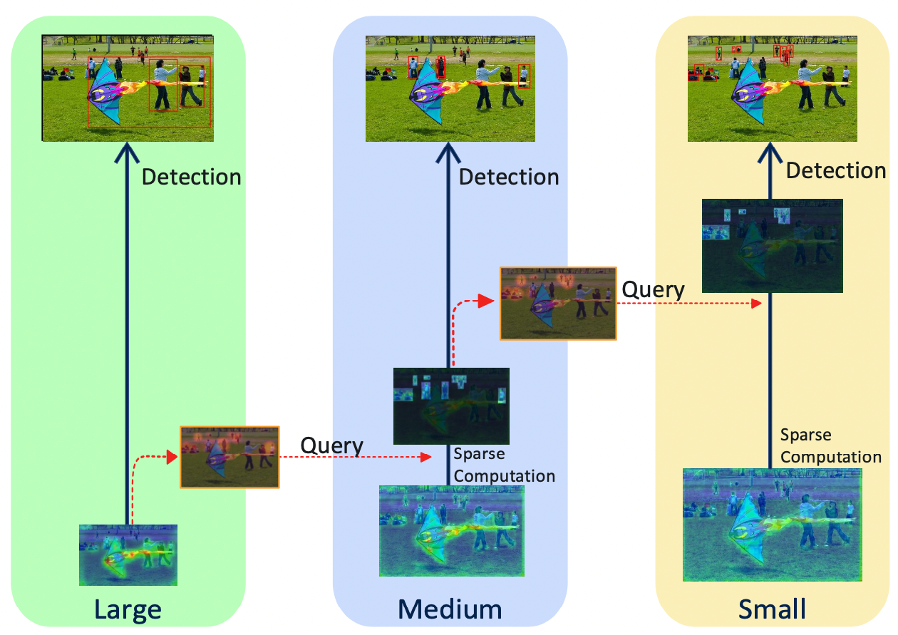

# QueryDet-PyTorch

<p align="center">

</p>

This repository is the official implementation of our paper: [QueryDet: Cascaded Sparse Query for Accelerating High-Resolution Small Object Detection, *Chenhongyi Yang*, *Zehao Huang*, *Naiyan Wang*. CVPR 2022](https://arxiv.org/abs/2103.09136)


## IMPORTANT UPDATE !!! 

We have updated the QueryDet repository to make it easier to use. Specifically:

- QueryDet now supports newer versions of PyTorch and Detectron2. 
- You do not need APEX any more. Now the FP16 training is through PyTorch AMP. 
- QueryDet now supports Spconv 2.1, which can be directly installed using pip. 
- We have improved the support for the VisDrone dataset.
- We have reorganlzed the model configs to make them easier to use. 


## Setting:

### Environment setting: 

We tested the new QueryDet with CUDA 10.2 using NVIDIA 2080Ti GPUs. We provide a sample setting up script as following:

```shell
conda create -n querydet python=3.7 -y
source activate querydet
pip install torch==1.8.1+cu101 torchvision==0.9.1+cu101 -f https://download.pytorch.org/whl/torch_stable.html
python -m pip install detectron2==0.4 -f https://dl.fbaipublicfiles.com/detectron2/wheels/cu102/torch1.7/index.html
pip install spconv-cu102==2.1.25

# Clone our repository and have fun with it! 
git clone https://github.com/ChenhongyiYang/QueryDet-PyTorch.git

# OPTIONAL: Install the python evaluation tool for VisDrone
# Reference: https://github.com/tjiiv-cprg/visdrone-det-toolkit-python
cd visdrone_eval
pip install -e .

# OPTIONAL: Install detectron2_backbone if you want to use backbone networks like MobileNet
# Reference: https://github.com/sxhxliang/detectron2_backbone 
git clone https://github.com/sxhxliang/detectron2_backbone.git
cd detectron2_backbone
python setup.py build develop
```

### COCO setting:

You need to set up COCO following the [official tutorial](https://detectron2.readthedocs.io/en/latest/tutorials/builtin_datasets.html) of Detectron2.  

### VisDrone setting:

We provide a full support for the VisDrone dataset.

- You need to download the VisDrone dataset from its [official website](http://aiskyeye.com/). 
- Unzip and place the downloaded dataset as following:

```
QueryDet-PyTorch
|-- data
    |-- visdrone
        |-- VisDrone2019-DET-train
        |   |-- images  
        |   |   |-- ...jpg  # 6471 .jpg files
        |   |-- annotations      
        |       |-- ...txt  # 6471 .txt files
        |-- VisDrone2019-DET-val
            |-- images  
            |   |-- ...jpg  # 548 .jpg files
            |-- annotations      
                |-- ...txt  # 548 .txt files
```

- Pre-process the dataset by running: `python visdrone/data_prepare.py --visdrone-root data/visdrone`.
- The resulted file structure will be as following: 

```
QueryDet-PyTorch
|-- data
    |-- visdrone
        |-- VisDrone2019-DET-train
        |   |-- images  
        |   |   |-- ...jpg  # 6471 .jpg files
        |   |-- annotations      
        |       |-- ...txt  # 6471 .txt files
        |-- VisDrone2019-DET-val
        |   |-- images  
        |   |   |-- ...jpg  # 548 .jpg files
        |   |-- annotations      
        |       |-- ...txt  # 548 .txt files
        |-- coco_format
            |-- train_images
            |   |-- ...jpg  # 25884 .jpg files
            |-- val_images  
            |   |-- ...jpg  # 548 .jpg files
            |-- annotations
                |-- train_label.json
                |-- val_label.json
```

-  After model training, you can evaluate your model by running `bash eval_visdrone.sh /path/to/visdrone_infer.json`.


## Usage

Before training, we recommend you to create a `work_dirs` directory to store all training results under `QueryDet-PyTorch` as following:

```
QueryDet-PyTorch
|-- work_dirs
|-- ...  # other stuffs
```

If you do not want you store your training results in other place, you can run `ln -s /path/to/your/storage work_dirs` to create a symbolic link.

In the following we will assume you have created such a directory and introdce the training, testing, and evaluating commands. 

### Training

```shell
% train coco RetinaNet baseline
python train_coco.py --config-file configs/coco/retinanet_train.yaml --num-gpu 8 OUTPUT_DIR work_dirs/coco_retinanet

% train coco QueryDet 
python train_coco.py --config-file configs/coco/querydet_train.yaml --num-gpu 8 OUTPUT_DIR work_dirs/coco_querydet

% train VisDrone RetinaNet baseline
python train_visdrone.py --config-file configs/visdrone/retinanet_train.yaml --num-gpu 8 OUTPUT_DIR work_dirs/visdrone_retinanet

% train VisDrone QueryDet
python train_visdrone.py --config-file configs/visdrone/querydet_train.pyaml --num-gpu 8 OUTPUT_DIR work_dirs/visdrone_querydet
```

### Testing

```shell
% test coco RetinaNet baseline
python infer_coco.py --config-file configs/coco/retinanet_test.yaml --num-gpu 8 --eval-only MODEL.WEIGHTS  work_dirs/coco_retinanet/model_final.pth OUTPUT_DIR work_dirs/model_test

% test coco QueryDet with Dense Inference
python infer_coco.py --config-file configs/coco/querydet_test.yaml --num-gpu 8 --eval-only MODEL.WEIGHTS work_dirs/coco_querydet/model_final.pth OUTPUT_DIR work_dirs/model_test

% test coco QueryDet with CSQ
export SPCONV_FILTER_HWIO="1"; python infer_coco.py --config-file configs/coco/querydet_test.yaml --num-gpu 8 --eval-only MODEL.WEIGHTS work_dirs/coco_querydet/model_final.pth OUTPUT_DIR work_dirs/model_test MODEL.QUERY.QUERY_INFER True 

% test VisDrone RetinaNet baseline
python infer_coco.py --config-file configs/visdrone/retinanet_test.yaml --num-gpu 8 --eval-only MODEL.WEIGHTS  work_dirs/visdrone_retinanet/model_final.pth OUTPUT_DIR work_dirs/model_test

% test VisDrone QueryDet with Dense Inference
python infer_coco.py --config-file configs/visdrone/querydet_test.yaml --num-gpu 8 --eval-only MODEL.WEIGHTS work_dirs/visdrone_querydet/model_final.pth OUTPUT_DIR work_dirs/model_test

% test VisDrone QueryDet with CSQ
export SPCONV_FILTER_HWIO="1"; python infer_coco.py --config-file configs/visdrone/querydet_test.yaml --num-gpu 8 --eval-only MODEL.WEIGHTS work_dirs/visdrone_querydet/model_final.pth OUTPUT_DIR work_dirs/model_test MODEL.QUERY.QUERY_INFER True
```

### Evaluation

- For COCO, Detectron2 will automatically evaluate the result when you run the inference command so you do not need to run any extra command.
- For VisDrone, after running an inference command, you will get a result file named `visdrone_infer.json` in your resulting directory (e.g., `work_dirs/model_test` in the above commands). Then you have two options to evluate the result:
  - If you have installed the Python evaluation tool then you can evaluate your result by running `bash eval_visdrone.sh work_dirs/model_test/visdrone_infer.json`
  - If you want to use the official Matlab evaluation tool, you can run `python visdrone/json_to_txt.py --out /path/to/result --gt-json data/visdrone/coco_format/annotations/val_label.json --det-json work_dirs/model_test/visdrone_infer.json` to convert the result to .txt files for Matlab evalutation.


## Citation
```
@InProceedings{Yang_2022_CVPR_QueryDet,
    author    = {{Yang, Chenhongyi and Huang, Zehao and Wang, Naiyan}},
    title     = {{QueryDet: Cascaded Sparse Query for Accelerating High-Resolution Small Object Detection},
    booktitle = {Proceedings of the IEEE/CVF Conference on Computer Vision and Pattern Recognition (CVPR)},
    year      = {2022}
}
```
